# Item Catalog

> Paras Agarkar

## About

This is the second project for the Udacity Full Stack Nanodegree. The Item Catalog project consists of developing an application that provides a list of items within a variety of categories, as well as provide a user registration and authentication system. This project uses persistent data storage to create a RESTful web application that allows users to perform Create, Read, Update, and Delete operations.

A user does not need to be logged in in order to read the categories or items uploaded. However, users who created an item are the only users allowed to update or delete the item that they created.

This program uses third-party auth with Google. Some of the technologies used to build this application include Flask, Bootsrap, Jinja2, and SQLite.

## Skills used for this project
- Python
- HTML
- CSS
- Bootstrap
- Flask
- Jinja2
- SQLAchemy
- Google OAuth2

## Some things you might need
- [Vagrant](https://www.vagrantup.com/)
- [Udacity Vagrantfile](https://github.com/udacity/fullstack-nanodegree-vm)
- [VirtualBox](https://www.virtualbox.org/wiki/Downloads)

## Getting Started

# Steps to run the program
1. Download and install Vagrant and VirtualBox.
2. Files for vagrant can be downloaded from https://s3.amazonaws.com/video.udacity-data.com/topher/2018/April/5acfbfa3_fsnd-virtual-machine/fsnd-virtual-machine.zip - This will help you install PostgreSQL, Python and other dependencies on the VM.
3. Start the Ubuntu Virtual Machine(VM) using : vagrant up
4. Connect to the Ubuntu VM using : vagrant ssh
5. Clone this repo into the `catlog/` directory found in the Vagrant directory
6. from the main directory run `sudo pip install -r requirements`
7. Setup database using 'python database_setup.py'
7. run application with `python application.py` from within its directory
8. go to `http://localhost:5000/` to access the application
*if first time running, you must add a category before adding an item

## JSON Endpoints

`/api/v1/catalog.json` - Returns JSON of all items in catalog

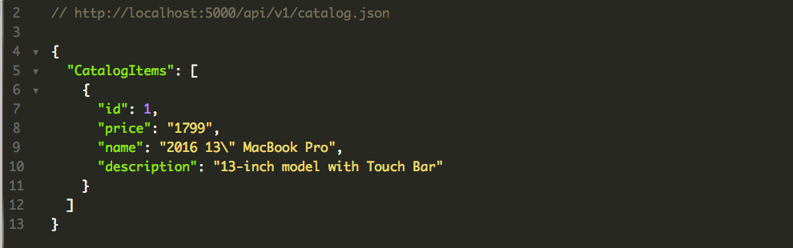

`/api/v1/categories/<int:category_id>/item/<int:catalog_item_id>/JSON` - Returns JSON of selected item in catalog

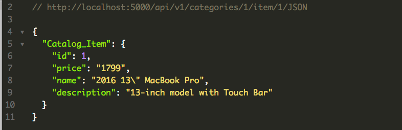

`/api/v1/categories/JSON` - Returns JSON of all categories in catalog

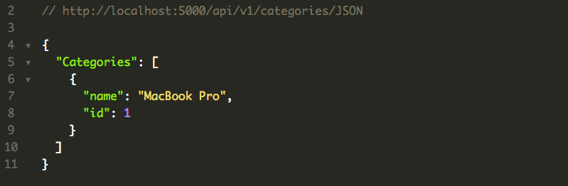

## REST Endpoints

#### --------------------------------------
#### CRUD for categories
#### --------------------------------------

`/` or `/categories` - Returns catalog page with all categories and recently added items

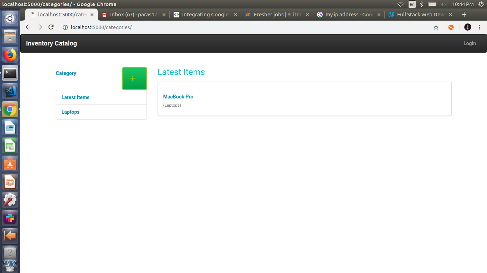

`/categories/new` - Allows user to create new category

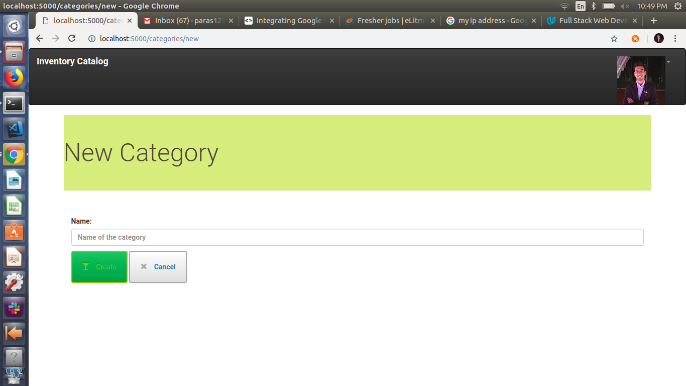

`/categories/<int:category_id>/edit/` - Allows user to edit an existing category

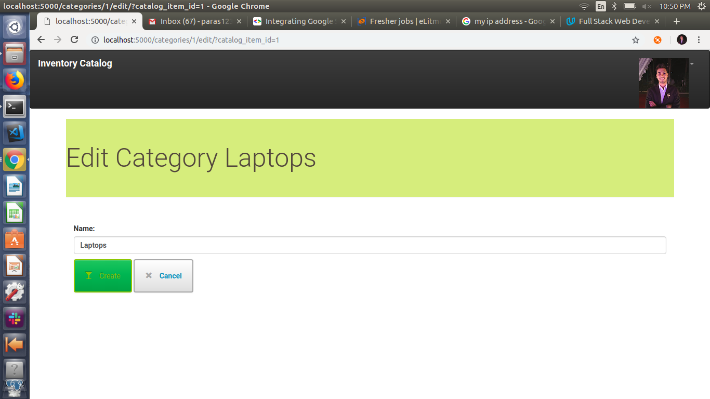

`/categories/<int:category_id>/delete/` - Allows user to delete an existing category

#### --------------------------------------
#### CRUD for category items
#### --------------------------------------

`/categories/<int:category_id>/` or `/categories/<int:category_id>/items/` - returns items in category

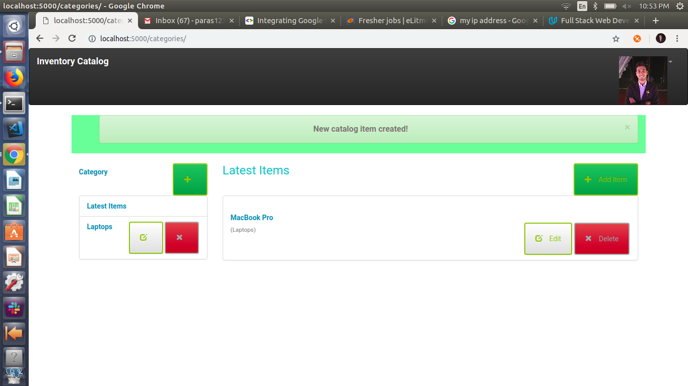

`/categories/<int:category_id>/item/<int:catalog_item_id>/` - returns category item

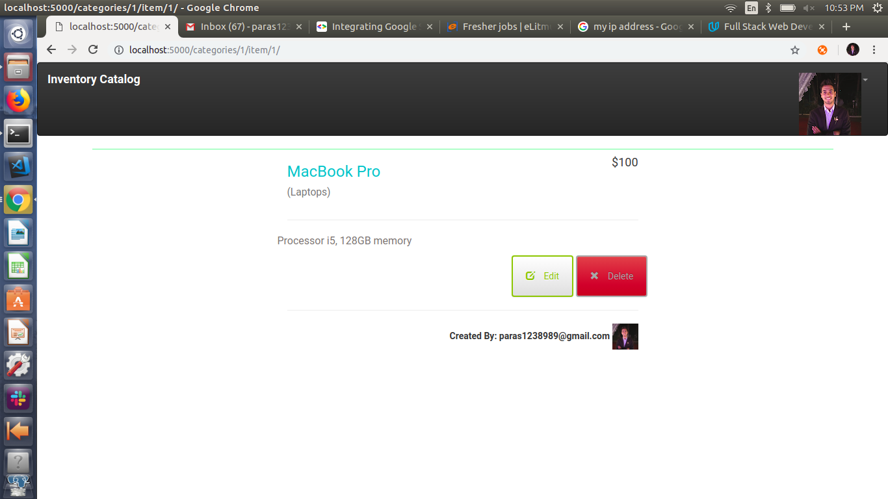

`/categories/item/new` - return "This page will be for making a new catalog item

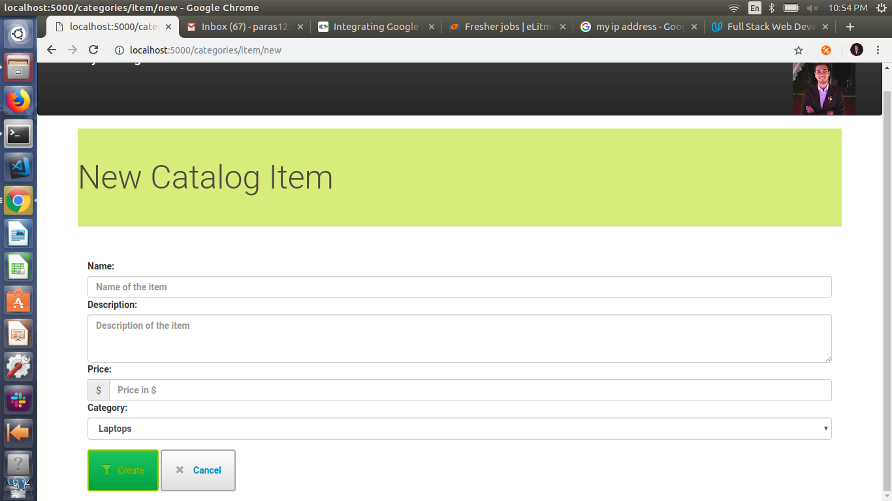

`/categories/<int:category_id>/item/<int:catalog_item_id>/edit` - return "This page will be for making a updating catalog item"

`/categories/<int:category_id>/item/<int:catalog_item_id>/delete` - return "This page will be for deleting a catalog item"

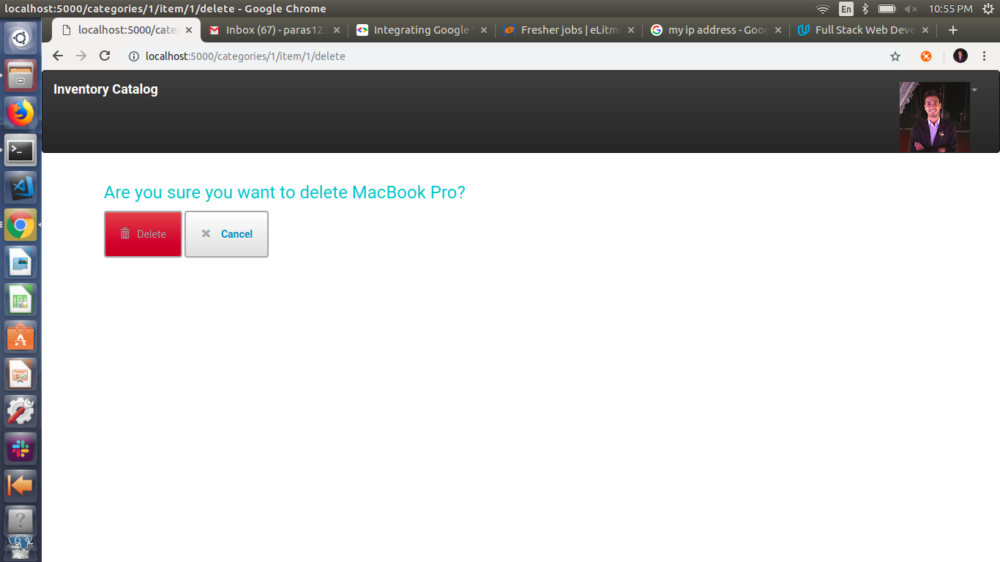

#### --------------------------------------
#### Login
#### --------------------------------------

`/login` - login page

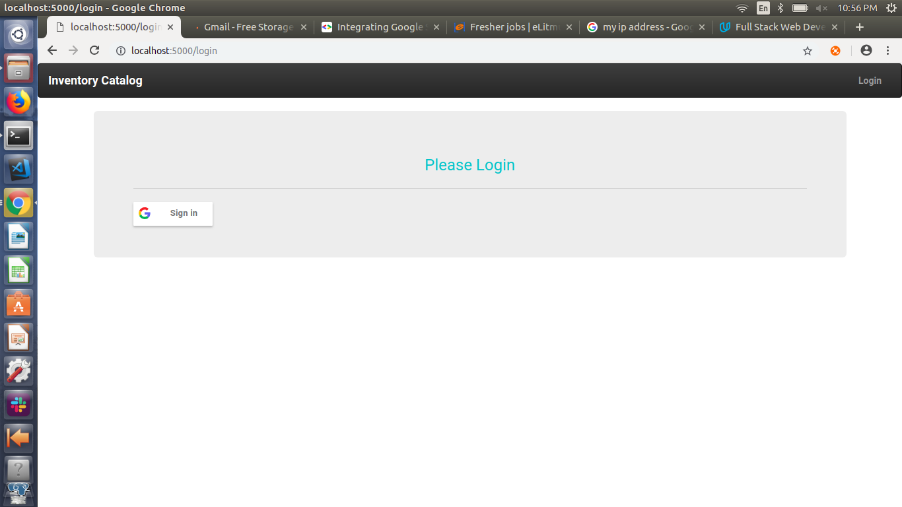

